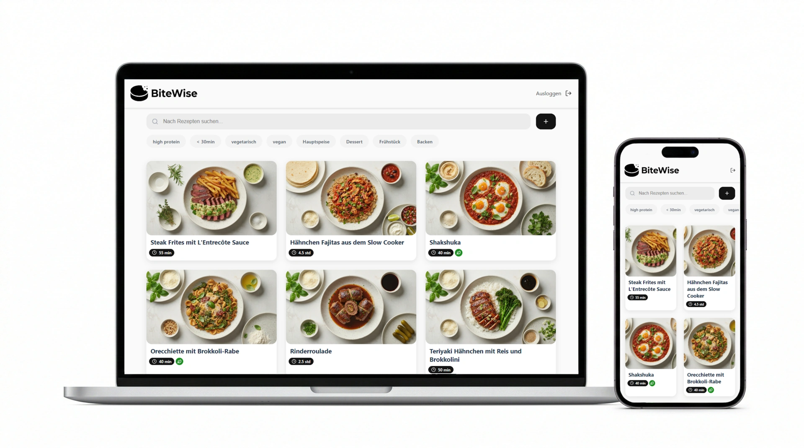

<div align="center">
  <h1>🍲 BiteWise (Smart Recipe Engine)</h1>
  <p><strong>An AI-powered pipeline for multimodal recipe extraction, normalization, and generation.</strong></p>

  <a href="https://github.com/kaiwmr/smart-recipe-app/actions/workflows/tests.yml"></a>
  <a href="https://fastapi.tiangolo.com/"></a>
  <a href="https://react.dev/"></a>
  <a href="https://openai.com/"></a>
  <a href="https://deepmind.google/technologies/gemini/"></a>
</div>

<br />

> **BiteWise** solves the problem of unstructured culinary data. It automatically scrapes websites and TikTok videos, extracts spoken or written instructions, normalizes them into structured JSON using Large Language Models, and generates missing assets (like studio-quality images) on the fly.

<div align="center">
  
</div>

---

## ✨ Core Engineering Features

Unlike standard CRUD applications, BiteWise focuses on processing complex, unstructured data streams:

- 🎥 **Multimodal Audio Extraction:** Utilizes `yt-dlp` to bypass standard scraping protections and extracts audio streams from short-form video platforms (TikTok).
- 🧠 **Speech-to-Text & AI Normalization:** Transcribes audio via **OpenAI Whisper** and utilizes LLMs with strict `pydantic` schemas and prompt engineering to normalize raw text into structured data (fraction-to-decimal conversion, ingredient categorization).
- 🎨 **Generative Assets:** Implements **Gemini 2.5 Flash** to dynamically generate high-quality recipe images matching a specific target style (`style_reference.png`), ensuring UI consistency.
- 🥗 **Algorithmic Nutrient Calculation:** Automatically aggregates macronutrients dynamically based on extracted ingredients and user-defined portion sizes.
- ⚡ **Modern SPA Frontend:** Built with React 19 and Vite, featuring a custom API service with Axios interceptors for robust JWT-based authentication handling.

## 🏗 System Architecture

The project follows a decoupled Client-Server architecture, designed for maintainability and clear separation of concerns.

```text
[ Client (React 19) ]  <-- REST / JSON -->  [ API Gateway (FastAPI) ]
                                                    |
                                                    ├──> Auth Service (JWT)
                                                    ├──> DB ORM (SQLAlchemy / PostgreSQL)
                                                    |
                                                    └──> AI Processing Pipeline
                                                           ├──> yt-dlp (Video Fetching)
                                                           ├──> Whisper API (Transcription)
                                                           ├──> LLM Parsing (Normalization)
                                                           └──> Gemini API (Image Gen)
```

## 🛠 Tech Stack

| Category | Technologies |
| --- | --- |
| **Backend** | Python 3.10+, FastAPI, SQLAlchemy, Pydantic, Pytest |
| **Frontend** | React 19, Vite, Axios, CSS Modules, React-Toastify |
| **AI / Data** | OpenAI API (Whisper, GPT), Google Gemini API, `yt-dlp` |
| **DevOps** | GitHub Actions (CI), Uvicorn |

## 🚀 Local Development Setup

To run this project locally, you will need **Python 3.10+**, **Node.js 18+**, and **FFmpeg** installed on your machine.

### 1. Clone & Environment Setup

```bash
git clone [https://github.com/kaiwmr/smart-recipe-app.git](https://github.com/kaiwmr/smart-recipe-app.git)
cd smart-recipe-app
```

### 2. Backend (FastAPI)

```bash
cd backend
python -m venv venv
source venv/bin/activate  # On Windows: venv\Scripts\activate

# Install dependencies (including FFmpeg requirements)
pip install -r requirements.txt

# Configure environment variables
cp .env.example .env
# ⚠️ EDIT .env: Add your OpenAI API Key, Gemini API Key, and DB connection string.

# Start the ASGI server
uvicorn main:app --reload
```

*API Documentation available at: `http://localhost:8000/docs`*

### 3. Frontend (React)

```bash
cd frontend
npm install

# Configure environment variables
cp .env.example .env

# Start the development server
npm run dev
```

*Frontend available at: `http://localhost:5173`*

## 🧪 Testing Pipeline

The backend features a comprehensive test suite using `pytest`. The testing environment leverages isolated test databases (`conftest.py`) and mocked external API responses to ensure reliable execution in CI environments.

```bash
cd backend
pytest -v
```

*Automated tests run on every push via GitHub Actions.*

## 📈 Roadmap & Future Enhancements

- [ ] **TypeScript Migration:** Refactoring the React frontend to TypeScript for enhanced enterprise-level type safety.
- [ ] **Asynchronous Task Queues:** Implementing `Celery` + `Redis` to offload the heavy AI processing pipeline (Video scraping & Image generation) into background workers, preventing HTTP timeouts.
- [ ] **Containerization:** Adding `Dockerfile` and `docker-compose.yml` for unified, system-agnostic deployments.

---

**Developed by Kai Weismayr | [LinkedIn](https://www.linkedin.com/in/kai-weismayr-5610b234b/)**